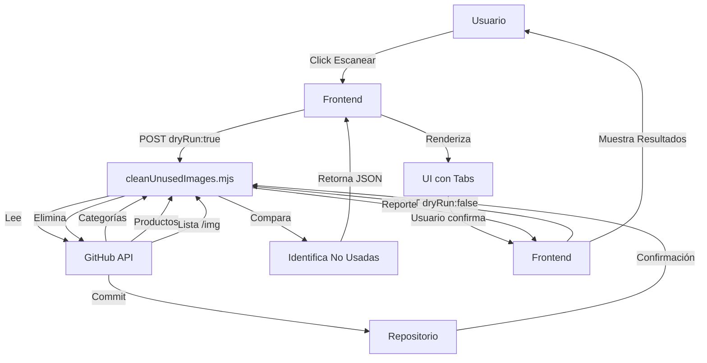

# 🧹 Funcionalidad de Limpieza de Imágenes - Resumen de Implementación

## ✅ **¡Implementación Completa!**

Se ha agregado una funcionalidad completa para limpiar imágenes no utilizadas en tu API. Aquí está todo lo que se ha creado:

---

## 📁 **Archivos Creados/Modificados**

### **Backend (Netlify Functions)**

1. **`netlify/functions/cleanUnusedImages.mjs`** (NUEVO)
   - Función principal de limpieza
   - Escanea productos, categorías y productos relacionados
   - Identifica imágenes en uso vs no utilizadas
   - Elimina imágenes de forma segura
   - Genera reportes detallados

2. **`netlify/functions/_shared.mjs`** (MODIFICADO)
   - Agregadas funciones `deleteFile()` y `listFiles()`
   - Soporte para operaciones de archivos en GitHub

### **Frontend (Admin Panel)**

3. **`public/index.html`** (MODIFICADO)
   - Nueva sección "Limpieza de Imágenes No Utilizadas"
   - Botones para escaneo y limpieza
   - Área de resultados interactiva

4. **`public/styles.css`** (MODIFICADO)
   - Estilos completos para la interfaz de limpieza
   - Tabs, cards, badges y estados visuales
   - Diseño responsive y atractivo

5. **`public/admin.js`** (MODIFICADO)
   - Funciones de escaneo y limpieza
   - Renderizado de resultados con tabs
   - Manejo de estados y errores
   - Confirmaciones de seguridad

### **Documentación**

6. **`CLEANUP_GUIDE.md`** (NUEVO)
   - Guía completa de uso
   - Casos de uso y ejemplos
   - Solución de problemas
   - Mejores prácticas

7. **`test_cleanup.html`** (NUEVO)
   - Página de prueba interactiva
   - Tests de escaneo y limpieza
   - Visualización de resultados

8. **`README.md`** (MODIFICADO)
   - Documentación de la nueva funcionalidad
   - Enlaces a guías adicionales

---

## 🎯 **Cómo Funciona**

### **Fase 1: Escaneo (Mode Prueba)**

```
1. Usuario hace clic en "Escanear Imágenes"
   ↓
2. Backend lee todas las categorías y productos
   ↓
3. Extrae URLs de todas las imágenes en uso
   ↓
4. Lista todos los archivos en /img
   ↓
5. Compara y genera reporte
   ↓
6. Frontend muestra resultados detallados
```

### **Fase 2: Limpieza (Eliminación Real)**

```
1. Usuario revisa reporte de escaneo
   ↓
2. Confirma eliminación
   ↓
3. Backend elimina imágenes no utilizadas
   ↓
4. Cada eliminación crea un commit en GitHub
   ↓
5. Frontend muestra resultados de limpieza
```

---

## 🔍 **Qué Imágenes se Escanean**

### **Productos**
- ✅ Imagen principal (`product.image`)
- ✅ Galería de imágenes (`product.images[]`)
- ✅ Imágenes de productos relacionados (`relatedProducts[].image`)

### **Categorías**
- ✅ Imagen de categoría (`category.imgSrc`)
- ✅ Categorías promocionales (Featured, Hot Sales)

### **Ubicaciones**
- `/products/{id}.json` - Productos completos
- `/cats_products/{id}.json` - Resúmenes de productos
- `/cats/cat.json` - Categorías principales
- `/cats/featured.json` - Productos destacados
- `/cats/hot_sales.json` - Ofertas flash

---

## 🎨 **Interfaz de Usuario**

### **Botones**
- **🔍 Escanear (Modo Prueba)**: Analiza sin eliminar nada
- **🗑️ Eliminar Imágenes**: Elimina permanentemente (requiere confirmación)

### **Pestañas de Resultados**
1. **🗑️ Sin Uso**: Lista de imágenes que serían/fueron eliminadas
2. **✅ En Uso**: Lista de imágenes conservadas con info de uso
3. **❌ Errores**: Problemas durante la eliminación (si los hay)

### **Resumen Visual**
- Total de imágenes en carpeta
- Imágenes en uso
- Imágenes sin uso
- Imágenes eliminadas (después de limpieza)

---

## 🛡️ **Características de Seguridad**

1. **Modo Prueba Primero**: Siempre escanea antes de eliminar
2. **Confirmación Doble**: Diálogo de confirmación antes de eliminar
3. **Botón Deshabilitado**: El botón de eliminar solo se habilita después de un escaneo
4. **Historial Git**: Cada eliminación queda registrada en Git
5. **Reporte Detallado**: Muestra exactamente qué se va a eliminar

---

## 📊 **Ejemplo de Uso**

### **Escenario: Tienes 100 imágenes en /img**

```bash
# Escaneo detecta:
- 75 imágenes en uso por productos
- 10 imágenes en uso por categorías
- 15 imágenes sin uso (huérfanas)

# Después de limpieza:
- 85 imágenes conservadas
- 15 imágenes eliminadas
- Repositorio más limpio y organizado
```

---

## 🚀 **Ventajas**

✅ **Ahorra Espacio**: Elimina archivos innecesarios del repositorio

✅ **Mejora Performance**: Menos archivos = clonado más rápido

✅ **Mantiene Orden**: API limpia y organizada

✅ **Evita Confusión**: Solo las imágenes necesarias existen

✅ **Seguro**: Modo prueba + confirmación + historial Git

---

## 🧪 **Testing**

### **Opción 1: Admin Panel Principal**
```
1. Abre http://tu-sitio.netlify.app
2. Scroll hasta "Limpieza de Imágenes No Utilizadas"
3. Haz clic en "Escanear Imágenes"
4. Revisa resultados
5. (Opcional) Haz clic en "Eliminar"
```

### **Opción 2: Página de Test**
```
1. Abre http://tu-sitio.netlify.app/test_cleanup.html
2. Usa los botones de test
3. Ve resultados detallados
```

---

## 📝 **Documentación Adicional**

- **Guía Completa**: Ver `CLEANUP_GUIDE.md`
- **API Reference**: Ver código en `cleanUnusedImages.mjs`
- **Ejemplos**: Ver `test_cleanup.html`

---

## 🔄 **Flujo de Datos**



---

## ✨ **Características Técnicas**

### **Performance**
- Escaneo: ~1-2 segundos por 100 productos
- Eliminación: ~0.5 segundos por imagen
- Operaciones secuenciales para evitar rate limits

### **Compatibilidad**
- Funciona con URLs completas y rutas relativas
- Normaliza diferentes formatos de URL
- Soporta subcarpetas en /img

### **Error Handling**
- Manejo robusto de errores
- Logs detallados en consola
- Reportes de errores al usuario
- No interrumpe proceso si falla una imagen

---

## 🎓 **Conceptos Clave**

**Dry Run**: Modo de prueba que simula la operación sin hacer cambios reales

**Image Usage Tracking**: Sistema que registra dónde se usa cada imagen

**Normalization**: Proceso de convertir diferentes formatos de URL a un formato estándar

**Safe Deletion**: Eliminación con confirmación y respaldo en historial Git

---

## 🎉 **¡Listo para Usar!**

La funcionalidad está completamente implementada y lista para deployment. Solo necesitas:

1. ✅ Variables de entorno configuradas en Netlify
2. ✅ Permisos de escritura en GitHub
3. ✅ Desplegar la nueva versión

**¡Ya puedes mantener tu API limpia y organizada!** 🧹✨

---

**Creado**: Octubre 2025
**Versión**: DIY API Admin v3.1
**Estado**: ✅ Producción Ready
